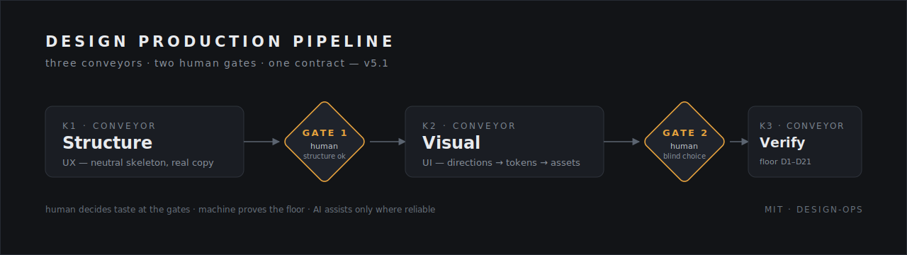

<p align="center">
  
</p>

# Design Production Pipeline v6.0



Turns a plain-text request into a **working interface foundation** for
websites AND web apps — assembled fast, machine-verified, testable locally,
and ready for further UI refinement whenever you want. Not a pretty-page
generator: a basic but real product that works from the first hour.

```
K0 discovery → K1 structure → GATE 1 (human) → K2A base skin (automatic)
→ K3 verification → [K2B full visual craft — optional, anytime] → [K4 deploy — optional, GATE 3]
```

## What it is

A skill pack for Codex CLI-style agents. Give it "make a landing page",
"prototype a dashboard with two roles", or "I have a prototype, make it look
good" — and it runs the request through a production line: structure first
(a neutral skeleton approved by a human), an automatic calibrated base skin,
then machine-verified quality. Full visual craft is an option you can
trigger today, next month, or never. The human makes the taste decisions;
the machine proves the floor; AI assists only where it is reliable.

## Why

- **The first artifact lands in minutes.** Verified Starters (`starters/`)
  ship pre-verified structure; copy injects through a slot map; finished
  projects feed new starters back through the harvest flywheel.
- **Real products are apps, not landings.** The `app` profile models the
  domain, RBAC, user flows, a state matrix and an OpenAPI contract with
  typed mock fixtures before screens.
- **Taste work never blocks a working product.** The base skin applies
  automatically after Gate 1; full visual work (K2B) is a restyle route over
  the finished foundation, never a rebuild.
- **No AI slop.** Divergence is constructed and machine-verified; a linted
  ban-list blocks the statistical defaults, every ban citing its evidence
  note in `knowledge/`.
- **Quality is proven, not claimed.** A deterministic floor D1–D24
  (including visual regression and a secrets scan); a missing capability
  reports an honest `unavailable` and caps the verdict.

## The skills

| Skill | Conveyor | Owns |
| :-- | :-- | :-- |
| `pipeline-orchestrator` | — | routing (site/app, starter-first, neutralize, restyle), the contract as single source of truth, gates, packs, decision log, delivery report |
| `structure-builder` | K1 | **UX** — experience model, domain + RBAC + state matrix (app), neutral skeleton, neutralization |
| `visual-director` | K2A/K2B | **UI** — automatic base skin; directions, blind choice, merge, DTCG tokens, assets (K2B) |
| `quality-guardian` | K3 | proof — deterministic floor D1–D24, AI diagnostics, quality report, verdict |

Sidecars: `packs/` (integration bus: manifest + acceptance test + frozen
registry per integration), `starters/` (Verified Starters + harvest),
`skins/` (base-site, base-app), `knowledge/` (evidence vault — Obsidian is
an optional viewer, never a dependency).

## Gates

- **Gate 1 (structure)** — the only mandatory human gate of the core:
  approve a picture (sitemap / flow-map + RBAC), not YAML.
- **Gate 2 (visuals)** — deferrable; runs only when K2B is requested. Blind
  contact sheet, merge by default.
- **Gate 3 (prod)** — only with an active deploy pack; explicit confirmation
  and a passed dry-run rollback.
- Any gate can be explicitly delegated to the machine (`provisional_ai`,
  recorded, with a confirmation offer on return).

Modes: **quick / standard / full** by project size and risk; **interactive**
(default) or **autonomous** interaction.

## Install

```bash
bash install.sh <target-repo>
```

Copies the package, checks dependencies (Python ≥3.10 + pyyaml, Bash
≥3.2-compatible; playwright optional — browser checks degrade honestly
without it), runs the self-test, prints the ready line. See `INSTALL.md`
for manual steps and the v5.x → v6.0 migration (`contract-migrate.py`).

First run: prompt P01 from `eval/example-prompts.md`, score with
`eval/eval-rubric.md` (pass ≥ 10/12).

## Changelog

- **v6.0** — working interface foundation: K2 split (automatic base skin +
  optional deferrable visual craft), app profile (domain, RBAC, state
  matrix, OpenAPI mocks), Verified Starters with harvest flywheel, pack
  integration bus, floor D1–D24, knowledge vault, contract schema 6.0.
- **v5.2** — macOS/BSD hardening, PyYAML contract reads, flake-free checks,
  D5/D15/D21 fixes, self-test circuit.
- **v5.1** — canonical D1–D21 registry, ready-family verdicts, degradation
  matrix, execution economy, decision log.

## License

MIT — see `LICENSE`.
